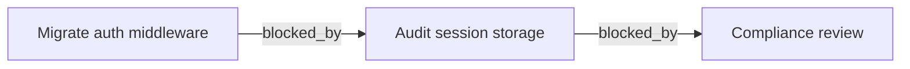

## Goal

`fmql subgraph` already emits `{nodes, edges}` JSON (`--format raw`) and a Cytoscape.js shape (`--format cytoscape`). Add a third format — `mermaid` — that emits a [Mermaid](https://mermaid.js.org) flowchart definition. fmql's home turf is markdown-with-frontmatter corpora, and Mermaid renders inline on GitHub, Obsidian, MkDocs, Docusaurus, and most modern markdown viewers. Being able to drop a dependency graph into a README, an ADR, or a task file (round-trip back into the same workspace fmql is querying) is a direct UX win and reinforces the knowledge-graph framing.

## Acceptance criteria

- [ ] `fmql subgraph <query> -w ROOT --format mermaid` emits a valid Mermaid `flowchart` definition to stdout — no surrounding fences, so callers can pipe or wrap as they prefer.
- [ ] Default direction is `LR` (left-to-right). Add `--mermaid-direction {LR,RL,TB,BT}` (or fold into a generic `--direction` if it doesn't collide with the existing traversal flag) to override.
- [ ] Node IDs are sanitized to a Mermaid-safe form (alphanumeric + underscore) derived from the packet's stable identifier (slug or path). Node labels show a human-readable string — title if present, else slug — and are quoted to survive special characters.
- [ ] Edges carry the relationship name as the edge label: `A -->|blocked_by| B`. Reverse-direction follows render with the arrow pointing the same way the underlying edge does in the data.
- [ ] Empty subgraphs emit a valid (if degenerate) `flowchart LR` block rather than erroring.
- [ ] Output is deterministic — nodes and edges are emitted in a stable order so the same workspace state produces the same Mermaid string (important for committing rendered diagrams into the workspace).
- [ ] README's `subgraph` section documents the new format with one rendered example.
- [ ] `make format && make lint && make test` clean, with tests covering: basic flowchart shape, label sanitization (quotes, pipes, parentheses in titles), empty subgraph, multi-edge-type graph, and direction override.

## Notes

### Example

```bash
fmql subgraph 'status = "active"' -w ./project --follow blocked_by --format mermaid
```



### Open questions

- **Multiple follow fields.** When `--follow` is given more than once (or when the workspace has heterogeneous edge types in the closure), edge labels should disambiguate. A future refinement could colour or style edges per relationship type using Mermaid `linkStyle` / `classDef`, but a textual label is sufficient for v1.
- **Node styling.** Out of scope for v1. A natural extension is `--mermaid-class-by FIELD` to emit `classDef` blocks keyed off a frontmatter field (e.g. status), but defer until someone asks.
- **Cycles.** Mermaid handles cycles natively, but the deterministic-ordering requirement means the cycle-entry node should be picked by stable rule (lowest sorted id), not insertion order.
- **Subgraphs (Mermaid `subgraph` blocks).** The naming collision between `fmql subgraph` and Mermaid's `subgraph` keyword is unfortunate but harmless — we're not generating Mermaid `subgraph` blocks in v1. If we later group nodes (e.g. by folder or by an inferred type from [0011](0011-document-type-pattern-matching.md)), that's where they'd come in.
